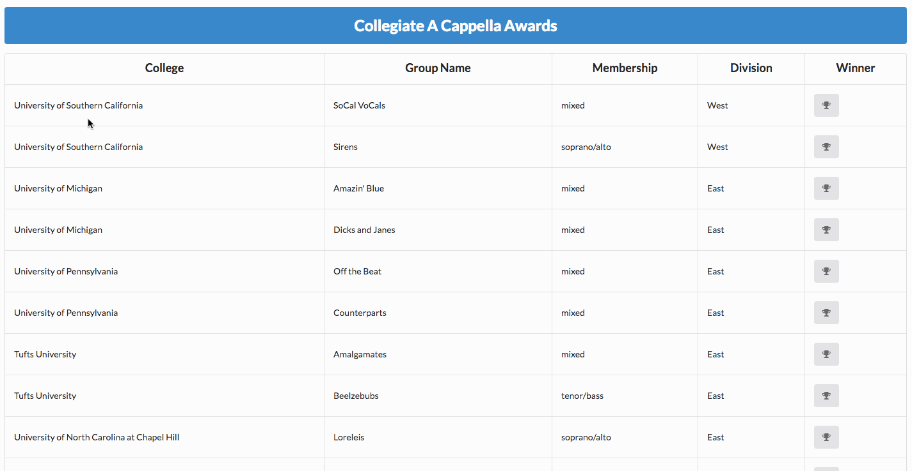

Congrats! You are a building a website for the the Collegiate A cappella Network. Below are the app deliverables.

- Your list of a cappella groups must be fetched from `http://starkiller-api.herokuapp.com/a_cappella_groups`
- Get the list of groups to display on the page and fill the table with relevant information.
- The tableRow function has been provided to you as a template for what needs to be added to the page.
- On click of a button, remove the associated group from the table and add it to the Winner h2.
- BONUS: If a new group is selected as winner, the new group should be removed from the table and replace the old group in the Winner h2. The old group should also return to the table. At any given time, all groups should be visible on the app, but each should appear only once.

